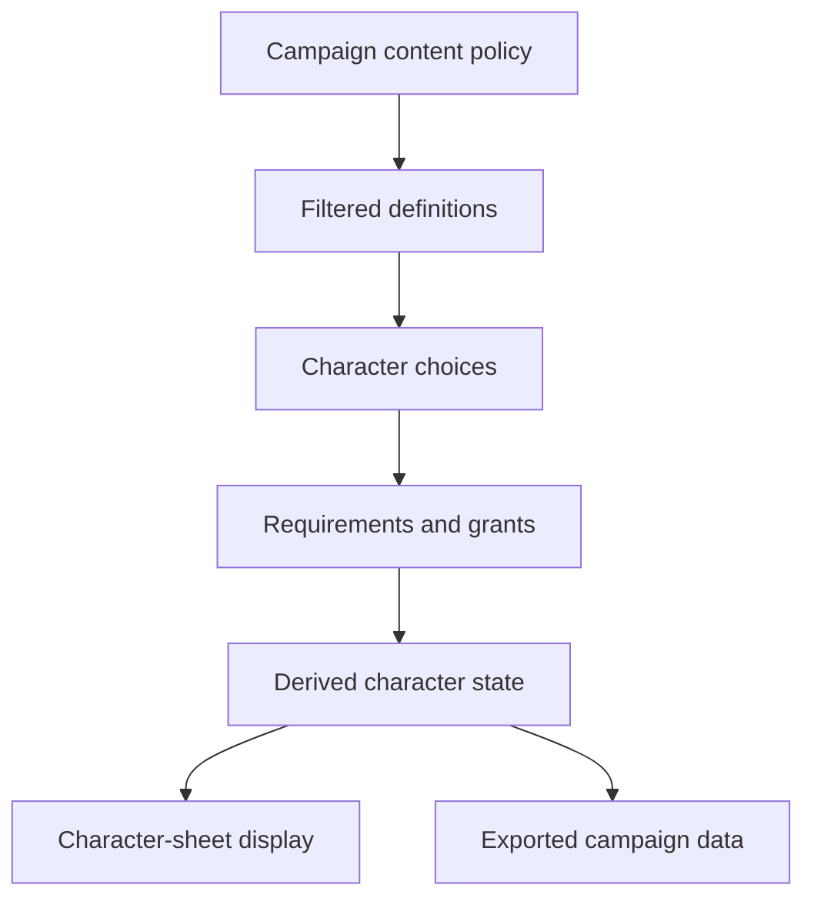

# WT Tools Character Sheet Build Specification

Status: Phase 0 build contract  
Canonical application: `docs/dashboard/`  
Rules data: vendored 5etools JSON under `docs/data/`

This document is the implementation contract for the character builder and
character sheet. It replaces the Phase 0 inventory formerly carried by
`DATA_MAP.md`.

## Product boundary

`docs/dashboard/` is the application that will be published and extended.
Useful interaction ideas from the local-only `site/` prototype may be ported
into it, but `site/` is not a second production target.

The builder owns choices and validation. The sheet is a view of exported,
derived character state. It must not infer lost choices from final totals.



## State contracts

The initial contracts live in `docs/dashboard/schemas/`:

- `campaign.schema.json` controls content filters, player slots, character
  assignments, custom content, and DM-hidden definitions.
- `character.schema.json` stores identity, base abilities, separate class
  progressions, subclass selections, background, species, proficiencies,
  spellcasting, resources, inventory instances, conditions, notes, and
  advancement history.
- `choice.schema.json` preserves requirements, options, selection bounds,
  grants, replacements, dependencies, and the selected option IDs.

All persisted records carry `schemaVersion`. Migrations must transform stored
records before validation; application code must never silently accept an
unknown version.

### Definitions versus instances

Vendored JSON records are immutable definitions. Character resources,
equipment, conditions, prepared spells, and choices are mutable instances that
refer back to definitions by a stable tuple:

```text
type | name | source
```

Feature references require the complete reference described below. Inventory
must use instance IDs so two copies of the same definition can have different
charges, notes, equipped state, or attunement.

## Content and edition policy

There is no implicit "PHB-only" mode. A campaign policy explicitly supplies:

- `ruleVersion`: `2014`, `2024`, or `mixed`
- `allowedSources`: exact source codes such as `PHB` and `XPHB`
- whether legacy records, Unearthed Arcana, and custom content are allowed
- optional `srd52` or `basicRules2024` requirements

Apply policy in this order:

1. Reject a record whose `source` is not explicitly allowed.
2. Reject UA, legacy, or custom content unless its policy flag is enabled.
3. Apply `srd52` and `basicRules2024` requirements when requested.
4. Resolve `reprintedAs` only to a record that also passes the policy.
5. Use `edition` as a compatibility signal, never as a replacement for source
   filtering. Records with no compatible edition are excluded unless the
   campaign uses `mixed`.
6. If both an older record and an allowed reprint survive, prefer the reprint
   and retain the old reference only for migration.

The UI must display the active policy and source code beside ambiguous names.

## Data resolver

All paths below are relative to `docs/`.

| Domain | Dataset | Principal collections | Resolver notes |
| --- | --- | --- | --- |
| Spells | `data/spells/index.json`, `data/spells/spells-<source>.json` | `spell[]` | Discover source files through the index. Do not read class eligibility from a spell record. |
| Spell eligibility | `data/generated/gendata-spell-source-lookup.json` | generated lookup | Join by spell name and source; this is authoritative for 2024 class lists. |
| Classes | `data/class/index.json`, `data/class/class-<name>.json` | `class[]`, `subclass[]`, `classFeature[]`, `subclassFeature[]` | Preserve source in every reference. |
| Subclass discovery | `data/generated/gendata-subclass-lookup.json` | generated lookup | Use for source-aware subclass options and lazy loading. |
| Species | `data/races.json` | `race[]`, `subrace[]` | A 2024 species usually does not grant ability increases. |
| Backgrounds | `data/backgrounds.json` | `background[]` | Resolve nested ability, proficiency, feat, and equipment choices. |
| Feats | `data/feats.json` | `feat[]` | Filter prerequisites and sources before presenting options. |
| Optional features | `data/optionalfeatures.json` | `optionalfeature[]` | Treat grants and replacements as choices. |
| Actions | `data/actions.json` | `action[]` | Reference definitions; do not copy rules text into character state. |
| Conditions | `data/conditionsdiseases.json` | `condition[]`, `disease[]`, `status[]` where present | Character conditions are instances of these definitions. |
| Magic items | `data/items.json` | `item[]`, `itemGroup[]` | Resolve base-item references before deriving display fields. |
| Mundane equipment | `data/items-base.json` | `baseitem[]` | This file does not use `item[]`. |
| Item metadata | `data/items-base.json` | `itemMastery[]`, `itemProperty[]`, `itemType[]` and related tables | Join weapon mastery, properties, and type definitions by their codes. |
| Bestiary | `data/bestiary/index.json`, `data/bestiary/bestiary-<source>.json` | `monster[]` | DM-hidden records must be removed before WebRTC serialization. |

Index files are discovery mechanisms. Load the index, apply the campaign's
allowed source set, and lazy-load only eligible files.

### Feature references

Class feature strings are pipe-delimited and must be parsed as:

```text
name | className | classSource | level
```

The lookup key is all four components:

```js
featureKey = `${name}|${className}|${classSource}|${level}`;
```

Never match a class feature by name, class, and level alone. PHB/XPHB
collisions are valid distinct definitions. Subclass feature keys must likewise
retain subclass name, subclass source, class name, class source, and level.

### Spell-list eligibility

The generated spell-source lookup is the source of class eligibility. Resolver
output should normalize each spell into:

```js
{
  definition: { type: "spell", name, source },
  classLists: [{ name: className, source: classSource }],
  legacyLists: []
}
```

Spell records may still contain descriptive or legacy class metadata, but the
builder must not depend on an embedded `classes` field.

### Background and species choices

For 2024 rules, background selection is the usual origin of ability increases.
Do not require or synthesize `race[].ability`.

Background parsing must emit choice records for:

- weighted ability increases
- skills, tools, and languages
- origin feats
- nested alternatives
- equipment package A versus starting-gold package B

An equipment package creates inventory instances only after selection.

## Choice engine

Every unresolved selection is a `choice.schema.json` record. The engine:

1. Builds choices from the selected class, level, subclass, background,
   species, feat, equipment package, and multiclass prerequisites.
2. Filters options using campaign policy and choice requirements.
3. Validates minimum and maximum selection counts.
4. Applies selected option grants to derived state.
5. Creates dependent choices when a grant requires another selection.
6. Invalidates downstream choices when their origin or dependency is removed.
7. Recomputes derived state from definitions plus surviving choices.

Changing a background, reducing a class level, or removing a multiclass must
revoke its grants and invalidate dependent choices. The engine must not mutate
base ability scores or proficiency arrays as an irreversible side effect.

## Class advancement and multiclassing

Each class has its own progression record. Total character level is the sum of
those records; never persist a flattened label such as "Wizard 3 / Rogue 2" as
the source of truth.

Class selection unlocks starting choices. Increasing a class level unlocks
features for that class and source. A subclass choice becomes available at the
level defined by the selected class record; the UI must not hard-code level
three for every class or edition.

Multiclass additions must validate prerequisites and apply multiclass-specific
proficiencies rather than first-level starting proficiencies.

## Derived character state

Derived values are disposable projections, including:

- total level and proficiency bonus
- ability modifiers, saves, skills, and passive scores
- armor class, movement, initiative, hit point limits, and hit dice
- available, known, and prepared spells
- spell slots and class resources
- actions and attacks
- active conditions and modifiers

Persist the inputs and selection history. Cache projections only with a
resolver version and discard them when definitions, choices, policy, or
resolver version changes.

## WebRTC messages

Messages sent by `docs/dashboard/js/room.js` use this envelope:

```json
{
  "version": "1.0.0",
  "type": "campaign.snapshot",
  "campaignId": "campaign-1",
  "sentAt": "2026-07-24T00:00:00Z",
  "payload": {}
}
```

Initial message types:

| Type | Direction | Payload |
| --- | --- | --- |
| `campaign.snapshot` | DM to player | Filtered campaign plus assigned character state |
| `character.update` | player to DM | Schema-valid character and choice changes |
| `character.assignment` | DM to player | Slot and character IDs |
| `initiative.update` | DM to players | Public initiative state |
| `error.validation` | either | Schema path and human-readable message |

Before `RTCDataChannel.send()`, the sender must:

1. validate the payload
2. remove definitions outside the campaign policy
3. remove `dmHiddenRecords`
4. include only the receiving player's private character data
5. serialize the versioned envelope

DM notes and hidden bestiary records must never be sent and then merely hidden
in the receiving DOM.

## Persistence and export

Browser persistence may remain in `localStorage` during the prototype, but it
must use separate versioned collections for campaigns, characters, and choices.
Export contains those source records, not only derived sheet totals. Import
validates all records before replacing active state and reports migrations.

## Phased implementation

### Phase 0 — contracts (complete)

- [x] Land this build specification and the three schemas.
- [x] Add schema-valid campaign, character, and choice examples.
- [x] Add resolver fixtures for PHB/XPHB name collisions, editionless spells
  without `classes`, `baseitem[]`, source-qualified item metadata, and nested
  backgrounds.
- [x] Enforce cross-record business invariants in executable contract tests.
- [x] Run the Phase 0 suite in GitHub Actions for dashboard changes.

Run the same suite locally from `docs/` after installing dependencies:

```sh
node --check dashboard/js/data-resolver.js
node --test dashboard/test/*.test.mjs
```

### Phase 1 — resolver and policy

- Implement indexed lazy loading and explicit source filters.
- Implement full feature keys, spell-source lookup joins, subclass lookup joins,
  reprint resolution, and item metadata joins.

### Phase 2 — builder

- Implement class progression, background, species, feat, equipment, spell,
  subclass, and multiclass choices.
- Recompute grants and invalidate dependent choices after edits.

### Phase 3 — sheet

- Port useful `site/` layout and drag/drop concepts into `docs/dashboard/`.
- Render the sheet exclusively from exported character and derived state.

### Phase 4 — campaign sync

- Validate versioned WebRTC messages.
- Enforce recipient filtering and DM-hidden removal before serialization.
- Add JSON import/export and migration tests.

## Definition of done

The character-sheet build is ready for implementation when:

- all persisted campaign, character, and choice examples validate
- feature collisions resolve by full source-aware keys
- 2024 spell eligibility works without `spell.classes`
- mundane equipment loads from `baseitem[]` with mastery and property joins
- removing a choice cleanly revokes its dependent grants
- multiclass progressions remain separate
- disallowed and DM-hidden records cannot appear in serialized player payloads
